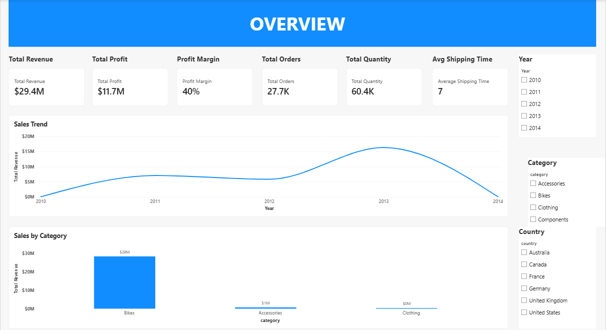

# ecommerce-sales-analysis-powerbi

## Project Overview

This project analyses an e-commerce dataset using Microsoft Power BI to uncover insights into sales performance, profitability, customers, products, and shipping activity.

The project builds on my previous SQL and Excel analyses of the same dataset, progressing from data querying and exploratory analysis to data modelling, DAX calculations, and interactive business intelligence reporting.

## Project Objectives

The main objectives of this project were to:

- Build a structured data model using fact and dimension tables.
- Clean and transform the data using Power Query.
- Create DAX measures for key business metrics.
- Analyse sales, profitability, customers, products, and shipping performance.
- Build an interactive multi-page Power BI report.
- Validate the Power BI results against the earlier SQL and Excel analyses.

## Business Questions

The analysis was designed to answer the following business questions:

1. What is the overall sales performance, and how does revenue trend over time?
2. Which product categories and subcategories generate the most revenue?
3. Which products are the top performers by revenue?
4. What is the overall profit and profit margin?
5. Which countries contribute the most revenue?
6. How are customers distributed by country, gender, and marital status?
7. What is the average shipping time?

## Dataset

The project uses three related tables:

### gold.fact_sales

Contains transaction-level sales information, including:

- Order Number
- Product Key
- Customer Key
- Order Date
- Shipping Date
- Due Date
- Sales Amount
- Quantity
- Price

### gold.dim_products

Contains product information, including:

- Product Key
- Product ID
- Product Number
- Product Name
- Category ID
- Category
- Subcategory
- Maintenance
- Cost
- Product Line
- Start Date

### gold.dim_customers

Contains customer information, including:

- Customer Key
- Customer ID
- Customer Number
- First Name
- Last Name
- Country
- Marital Status
- Gender
- Birthdate
- Create Date

## Data Preparation

The data was cleaned and transformed in Power Query before being loaded into the Power BI model.

Key transformations included:

- Assigning appropriate data types to numeric, text, and date columns.
- Cleaning and trimming text fields.
- Creating a full_name field from first and last names.
- Reviewing missing values without replacing valid unknown information with fabricated values.
- Preserving valid repeated order numbers because an order can contain multiple sales lines.
- Preparing the tables for relational modelling.

A dedicated Calendar table was also created to support time-based analysis and connected to fact_sales through order_date.

## Data Model

The Power BI model follows a basic star-schema structure:

Relationships were created using:

- dim_customers[customer_key] → fact_sales[customer_key]
- dim_products[product_key] → fact_sales[product_key]
- Calendar[Date] → fact_sales[order_date]
The dimension tables are on the one side of the relationships, while fact_sales is on the many side.

## DAX Measures

The report uses DAX measures to calculate the core business metrics.

### Total Revenue
- Total Revenue =
SUM(fact_sales[sales_amount])

### Total Profit
- Total Profit =
SUMX(
    fact_sales,
    fact_sales[sales_amount] -
    (fact_sales[quantity] * RELATED(dim_products[cost]))
)

### Profit Margin
- Profit Margin =
DIVIDE([Total Profit], [Total Revenue])

### Total Orders
- Total Orders =
DISTINCTCOUNT(fact_sales[order_number])

### Total Quantity
- Total Quantity =
SUM(fact_sales[quantity])

### Total Customers
- Total Customers =
DISTINCTCOUNT(fact_sales[customer_key])

### Average Shipping Time
- Average Shipping Time =
AVERAGEX(
    FILTER(
        fact_sales,
        NOT ISBLANK(fact_sales[order_date]) &&
        NOT ISBLANK(fact_sales[shipping_date])
    ),
    DATEDIFF(
        fact_sales[order_date],
        fact_sales[shipping_date],
        DAY
    )
)

## Report Pages
### 1. Overview

Provides a high-level summary of business performance through:

- Total Revenue
- Total Profit
- Profit Margin
- Total Orders
- Total Quantity
- Average Shipping Time
- Sales Trend
- Sales by Category
- Year, Category, and Country slicers

### 2. Customer Analysis

Focuses on customer characteristics and revenue contribution through:

- Sales by Country
- Customers by Gender
- Customers by Marital Status
- Customer Details table

### 3. Product Analysis

Focuses on product performance through:

- Sales by Category
- Sales by Subcategory
- Top 10 Products by Sales
- Product Details table

## Key Insights

The analysis produced the following notable findings:

- Total revenue was approximately $29.4M.
- Total profit was approximately $11.7M, with an overall profit margin of approximately 40%.
- The dataset contained 27,659 distinct orders.
- Total quantity sold was 60,423 units.
- Average shipping time was approximately 7 days.
- Revenue was concentrated in categories with recorded sales activity, while Components represented a substantial portion of the product catalogue but generated no recorded revenue in the dataset.
  
## Validation

The Power BI results were cross-checked against the earlier SQL and Excel analyses of the same dataset to confirm consistency in key metrics and business results.

This provided an additional validation step for the Power Query transformations, relationships, and DAX measures.

## Tools Used
- Microsoft Power BI – Data modelling, DAX, visualisation, and reporting
- Power Query – Data cleaning and transformation
- DAX – Business calculations and measures
- PostgreSQL – Data querying and preparation
- Microsoft Excel – Exploratory analysis and previous dashboard development
- GitHub – Project documentation and portfolio hosting

## Project 
This project is part of a broader e-commerce analytics workflow using the same dataset across multiple tools:

SQL → Excel → Power BI

SQL was used to query and prepare the data, Excel was used for exploratory analysis, Pivot Tables, Pivot Charts, and dashboarding, while Power BI was used to build a relational data model, create DAX measures, and develop an interactive business intelligence report.

## About Me

Hi there! I'm Elizabeth Antai, a Product Designer transitioning into Data Analytics, building SQL, Excel & Power BI projects that turn data into business insights.
